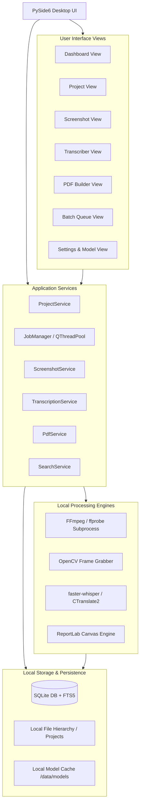
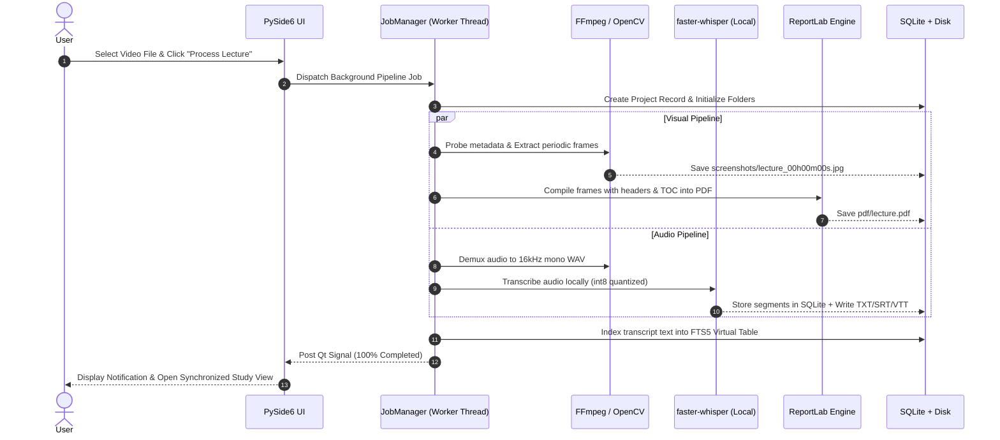
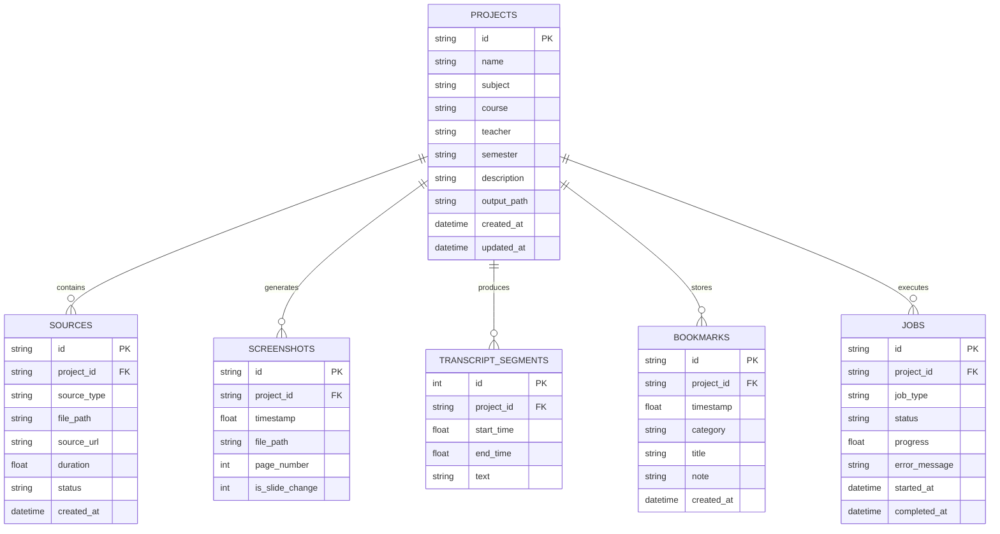

# FULL SYSTEM DOCUMENTATION
# LocalStudy — Offline Lecture Processing Toolkit

> **Version:** 1.0.0-Specification  
> **Status:** Architecture Blueprint & Technical Manual  
> **Deployment Target:** Local Desktop (Windows 10/11, macOS, Linux)  
> **Core Principle:** **100% Local Processing • Zero External AI APIs • Zero Cloud Telemetry • Air-Gapped Operation**

---

## Table of Contents
1. [Executive Summary & Core Value Proposition](#1-executive-summary--core-value-proposition)
2. [System Architecture & Data Flow](#2-system-architecture--data-flow)
3. [Component & Module Breakdown](#3-component--module-breakdown)
   - 3.1. Dashboard & Navigation
   - 3.2. Project Management System
   - 3.3. Video Processing & Screenshot Extractor
   - 3.4. Timestamp & Visual Overlay Engine
   - 3.5. PDF Compilation Engine (ReportLab)
   - 3.6. Audio Extraction & Local Transcription Pipeline
   - 3.7. Subtitle & Transcript Exporters (TXT, SRT, VTT)
   - 3.8. Searchable Transcript & Synchronized Media Player
   - 3.9. Lecture Indexing & Bookmark Management
   - 3.10. Batch Processing & Job Queue Manager
   - 3.11. Hardware Profiler & Model Cache Manager
4. [Database Architecture & Schema (SQLite + FTS5)](#4-database-architecture--schema-sqlite--fts5)
5. [Storage Architecture & File Naming Conventions](#5-storage-architecture--file-naming-conventions)
6. [Hardware Performance Profiling & Optimization](#6-hardware-performance-profiling--optimization)
7. [Security, Privacy & Offline Validation](#7-security-privacy--offline-validation)
8. [Developer Guide & Service Layer API](#8-developer-guide--service-layer-api)
9. [Packaging & Distribution (PyInstaller)](#9-packaging--distribution-pyinstaller)

---

## 1. Executive Summary & Core Value Proposition

Modern academic learning relies heavily on long-form recorded video lectures (typically 60 to 180 minutes). Students, educators, and researchers face major challenges studying from raw video files:
* Scrubbing through multi-hour videos to locate a specific slide or diagram is tedious and inefficient.
* Cloud-based AI transcription services are expensive, charge per-minute or per-token fees, require high-bandwidth uploads of multi-gigabyte media files, and compromise intellectual property and student privacy.
* Simple script-based tools require terminal knowledge, lack unified project tracking, and fail to synchronize visual slides with spoken lecture transcripts.

**LocalStudy** solves this problem by delivering a unified, **100% offline desktop application** built with Python and PySide6 (Qt6). LocalStudy transforms raw video or audio lectures into structured, printable study guides (PDFs with timestamp overlays), accurate timestamped transcripts (TXT, SRT, VTT), and an instantly searchable SQLite knowledge base—running entirely on consumer hardware without calling external APIs or sending telemetry to the cloud.

---

## 2. System Architecture & Data Flow

LocalStudy follows a strict **Layered Service-Oriented Architecture (SOA)**, separating the user interface, background orchestrators, low-level media engines, and persistent relational storage.

### 2.1. High-Level Architecture Diagram



### 2.2. Processing Data Flow



---

## 3. Component & Module Breakdown

### 3.1. Dashboard & Navigation
* **Persistent Sidebar:** Modern Qt-based navigation pane providing access to the Dashboard, Projects, Video Processor, Audio Transcriber, PDF Builder, Batch Queue, and Settings.
* **Quick Stats:** Displays total processed lectures, total study pages generated, disk space consumed, and active background tasks.
* **Recent Projects List:** One-click resumption of recently accessed lectures with thumbnail previews, creation timestamps, and completion badges.
* **Quick Action Launchers:** Direct triggers for "New Project", "Quick Screenshot Capture", and "Quick Transcribe".

### 3.2. Project Management System
Every lecture is treated as an isolated, self-contained **Project**.
* **Metadata Schema:** Project Name, Subject/Course Title, Course Code (e.g., `CSE-321`), Instructor/Professor Name, Academic Semester, Lecture Date, Source URI/Path, and Notes.
* **Integrity Guarantee:** If a user moves or renames a project folder, the application automatically detects the relocated manifest (`project.json`) and repairs local paths.

### 3.3. Video Processing & Screenshot Extractor
The video module utilizes OpenCV and FFmpeg to extract high-fidelity frames from local video files (or user-authorized remote video streams via `yt-dlp`).
* **Capture Modes:**
  1. *Fixed-Interval Mode:* Extracts a frame every $N$ seconds (e.g., 5s, 15s, 30s, 60s, or custom user interval).
  2. *Custom Timestamps Mode:* Parses user-entered timestamps (`HH:MM:SS` or `MM:SS`) and extracts exact keyframes.
  3. *Scene Change Detection (Smart Mode):* Uses frame-to-frame histogram comparison to capture slide transitions automatically without redundant duplicate frames.
* **Resolution Control:** Supports native resolution capture or downscaling to 1080p, 720p, or 480p to conserve disk space.

### 3.4. Timestamp & Visual Overlay Engine
Every extracted screenshot can be augmented with a non-destructive or burnt-in visual metadata overlay:
* **Overlay Elements:** Course Name, Lecture Title, Timestamp Badge (`[HH:MM:SS]`), and Slide Index.
* **Visual Styling:** High-contrast anti-aliased typography (Google Outfit or Inter), rendered inside a semi-transparent dark pill background in the corner of the frame to prevent obscuring slide content.
* **Dual Export:** Option to save clean raw frames and overlay-applied frames separately.

### 3.5. PDF Compilation Engine (ReportLab)
Compiles hundreds of lecture frames into structured, publication-quality PDF documents.
* **Cover Page:** Formal title page featuring university/institution name, course title, lecture topic, instructor name, date of processing, and total slide count.
* **Lecture Summary & Table of Contents:** Displays duration, extraction parameters, and hyperlinked timestamp index.
* **Layout Presets:**
  * **1-Up (Standard):** 1 slide per page, maximizing readability for mathematical equations and code blocks, accompanied by ruled lines for handwritten notes.
  * **2-Up (Stacked):** 2 slides per page vertically aligned, balancing readability and print economy.
  * **4-Up (Handout Grid):** 2x2 grid layout, perfect for slide-heavy lectures and reducing physical page counts.
  * **Contact Sheet (Thumbnail Index):** Compact multi-column index at the end of the document for rapid visual skimming.
* **Custom Numbered Canvas:** Generates dynamic "Page X of Y" pagination, running headers, and lecture identifiers.

### 3.6. Audio Extraction & Local Transcription Pipeline
* **Audio Extraction:** FFmpeg demuxes the primary audio stream, converting any source container (`MP4`, `MKV`, `AVI`, `MP3`, `M4A`, `FLAC`, `AAC`, `WAV`) into normalized 16kHz 16-bit mono PCM WAV (`pcm_s16le`).
* **Local Inference Engine:** Implemented via `faster-whisper` (CTranslate2 execution engine).
* **Model Tiers:**
  * `tiny` (~75 MB): Ultra-fast, ideal for low-spec laptops.
  * `base` (~140 MB): Good balance of speed and basic English comprehension.
  * `small` (~460 MB): **Recommended default** for multilingual lectures (English, Bangla, Hindi).
  * `medium` (~1.5 GB): High precision for heavy technical/mathematical terminology.
  * `large-v3` (~3.1 GB): Maximum phonetic and syntactic accuracy.
* **Multilingual & Mixed-Language Support:**
  * Native support for English, Bangla (`bn`), Hindi (`hi`), Urdu (`ur`), Spanish, etc.
  * Optimized decoding parameters for Code-Switching (e.g. lectures spoken in Bangla with English technical terminology).

### 3.7. Subtitle & Transcript Exporters (TXT, SRT, VTT)
Converts raw model segment objects into industry-standard study formats:
* **Timestamped TXT:**
  ```text
  [00:00:15]
  Welcome back everyone. Today we are exploring the Transport Layer of the OSI Model.

  [00:00:45]
  Specifically, we will analyze the TCP three-way handshake mechanism.
  ```
* **Standard SubRip (SRT):** Standard sequence numbers and millisecond markers for universal media player playback.
* **WebVTT (VTT):** HTML5-compliant subtitle tracks for modern web and desktop media players.
* **Structured JSON:** Complete token-level arrays containing start time, end time, text, confidence scores, and compression ratios.

### 3.8. Searchable Transcript & Synchronized Media Player
* **SQLite FTS5 Full-Text Search:** Sub-millisecond keyword lookup across hours of speech.
* **Synchronized Tri-View Playback:**
  * Integrated Qt video player widget.
  * Transcript timeline auto-scrolls to follow the current playback position.
  * Clicking any word or timestamp in the transcript instantly seeks the video to that exact millisecond.
  * Slide preview updates in real-time to show the nearest screenshot corresponding to the spoken sentence.

### 3.9. Lecture Indexing & Bookmark Management
* **Manual Bookmarking:** Users can press a hotkey (`Ctrl + B`) during review to bookmark the current timestamp.
* **Category Tags:** Categorize bookmarks as `⭐ Exam Topic`, `💡 Core Concept`, `❓ Question / Clarify`, `📝 Homework Reference`.
* **Exportable Notes:** Bookmarks are saved to both SQLite and a portable `bookmarks.json` file inside the project directory.

### 3.10. Batch Processing & Job Queue Manager
* **Multi-Lecture Queue:** Users can queue dozens of video files or URLs for overnight processing.
* **State Machine:** Manages states (`IDLE`, `QUEUED`, `EXTRACTING_FRAMES`, `TRANSCRIBING`, `COMPILING_PDF`, `COMPLETED`, `PAUSED`, `FAILED`).
* **Resumability & Checkpointing:** If a process is cancelled or the machine shuts down at 75%, LocalStudy detects existing frames on disk and resumes from the last completed checkpoint rather than re-running from scratch.

### 3.11. Hardware Profiler & Model Cache Manager
* **Automated Detection:** Detects CPU cores, available physical RAM, and hardware acceleration at startup.
* **Model Cache Management:** Models downloaded via the Settings view are saved into `data/models/` and verified with cryptographic checksums. Once downloaded, the application can run in a permanently air-gapped environment.

---

## 4. Database Architecture & Schema (SQLite + FTS5)

LocalStudy uses a zero-configuration SQLite database (`data/localstudy.db`) with Write-Ahead Logging (`WAL`) enabled for high-concurrency read/write operations.

### 4.1. Entity Relationship Diagram



### 4.2. SQL Schema DDL

```sql
-- Enable foreign keys and WAL mode
PRAGMA foreign_keys = ON;
PRAGMA journal_mode = WAL;

-- Projects Table
CREATE TABLE IF NOT EXISTS projects (
    id TEXT PRIMARY KEY,
    name TEXT NOT NULL,
    subject TEXT,
    course TEXT,
    teacher TEXT,
    semester TEXT,
    description TEXT,
    output_path TEXT NOT NULL,
    created_at TIMESTAMP DEFAULT CURRENT_TIMESTAMP,
    updated_at TIMESTAMP DEFAULT CURRENT_TIMESTAMP
);

-- Media Sources Table
CREATE TABLE IF NOT EXISTS sources (
    id TEXT PRIMARY KEY,
    project_id TEXT NOT NULL REFERENCES projects(id) ON DELETE CASCADE,
    source_type TEXT NOT NULL CHECK(source_type IN ('local_video', 'local_audio', 'url')),
    file_path TEXT,
    source_url TEXT,
    duration REAL DEFAULT 0.0,
    status TEXT DEFAULT 'pending',
    created_at TIMESTAMP DEFAULT CURRENT_TIMESTAMP
);

-- Screenshots Table
CREATE TABLE IF NOT EXISTS screenshots (
    id TEXT PRIMARY KEY,
    project_id TEXT NOT NULL REFERENCES projects(id) ON DELETE CASCADE,
    timestamp REAL NOT NULL,
    file_path TEXT NOT NULL,
    page_number INTEGER,
    is_slide_change INTEGER DEFAULT 0
);

-- Transcript Segments Table
CREATE TABLE IF NOT EXISTS transcript_segments (
    id INTEGER PRIMARY KEY AUTOINCREMENT,
    project_id TEXT NOT NULL REFERENCES projects(id) ON DELETE CASCADE,
    start_time REAL NOT NULL,
    end_time REAL NOT NULL,
    text TEXT NOT NULL
);

-- SQLite FTS5 Virtual Table for Sub-Millisecond Search
CREATE VIRTUAL TABLE IF NOT EXISTS transcript_fts USING fts5(
    project_id UNINDEXED,
    segment_id UNINDEXED,
    text,
    tokenize = 'porter unicode61'
);

-- Bookmarks Table
CREATE TABLE IF NOT EXISTS bookmarks (
    id TEXT PRIMARY KEY,
    project_id TEXT NOT NULL REFERENCES projects(id) ON DELETE CASCADE,
    timestamp REAL NOT NULL,
    category TEXT DEFAULT 'general',
    title TEXT NOT NULL,
    note TEXT,
    created_at TIMESTAMP DEFAULT CURRENT_TIMESTAMP
);

-- Background Jobs Table
CREATE TABLE IF NOT EXISTS jobs (
    id TEXT PRIMARY KEY,
    project_id TEXT REFERENCES projects(id) ON DELETE SET NULL,
    job_type TEXT NOT NULL,
    status TEXT NOT NULL DEFAULT 'queued',
    progress REAL DEFAULT 0.0,
    error_message TEXT,
    started_at TIMESTAMP,
    completed_at TIMESTAMP
);

-- Performance Indexes
CREATE INDEX IF NOT EXISTS idx_screenshots_project_ts ON screenshots(project_id, timestamp);
CREATE INDEX IF NOT EXISTS idx_segments_project_time ON transcript_segments(project_id, start_time);
CREATE INDEX IF NOT EXISTS idx_bookmarks_project_ts ON bookmarks(project_id, timestamp);
```

---

## 5. Storage Architecture & File Naming Conventions

### 5.1. Standard Project Directory Structure
Every project created by LocalStudy maintains a predictable, self-contained file hierarchy on the user's hard drive:

```text
D:/StudyVault/Projects/Computer_Networks_TCP/
│
├── project.json                 # Self-contained project manifest & parameters
│
├── source/                      # Symlink or local copy of lecture video/audio
│   └── lecture_source.mp4
│
├── screenshots/                 # High-resolution periodic captured frames
│   ├── lecture_00h00m00s.jpg
│   ├── lecture_00h00m30s.jpg
│   ├── lecture_00h01m00s.jpg
│   └── ...
│
├── transcript/                  # Generated transcript artifacts
│   ├── transcript.txt           # Formatted timestamped text
│   ├── transcript.srt           # SubRip subtitle track
│   ├── transcript.vtt           # WebVTT subtitle track
│   └── segments.json            # Structured segment data
│
├── pdf/                         # Generated study PDF documents
│   ├── lecture_study_guide.pdf
│   └── lecture_handout_4up.pdf
│
├── metadata/                    # Machine-readable lecture indices
│   ├── metadata.json            # Hardware & processing log summary
│   └── bookmarks.json           # Student study bookmarks & exam notes
│
└── logs/                        # Dedicated operation execution log
    └── processing.log
```

### 5.2. File Naming Rules
1. **Never use sequential counters alone:** Do not name files `image1.jpg` or `frame_2.png`.
2. **Timestamped format:** Always format frame filenames using explicit zero-padded hours, minutes, and seconds:  
   `lecture_{HH}h{MM}m{SS}s.jpg` (e.g. `lecture_01h24m35s.jpg`).
3. **Collision Resistance:** In cases where multiple frames are taken within the same second, append millisecond tokens: `lecture_01h24m35s_500ms.jpg`.

---

## 6. Hardware Performance Profiling & Optimization

### 6.1. Baseline Hardware Profile
* **Target Processor:** AMD Ryzen 7 5600G (6 Cores, 12 Threads, base clock 3.9 GHz, boost up to 4.4 GHz)
* **RAM:** 16 GB DDR4 Dual-Channel
* **Graphics:** Integrated AMD Radeon Vega 7 Graphics (Uses system RAM)
* **Storage:** PCIe NVMe SSD

### 6.2. Optimization Tactics for Ryzen 5600G
1. **Thread Budgeting:**
   * Allocate **4 CPU threads** to `faster-whisper` and FFmpeg tasks.
   * Reserve **2 physical cores (4 threads)** strictly for the operating system and Qt GUI event loop to ensure zero interface stuttering or lag.
2. **Quantization Mode (`int8`):**
   * Using 8-bit integer quantization (`compute_type="int8"`) reduces memory consumption by ~50% compared to `float32` while maintaining >99% transcription accuracy.
   * Avoids out-of-memory (OOM) risks on 16GB systems when processing 4-hour lectures.
3. **Storage Pre-Allocation & Disk Space Guard:**
   * Before launching frame extraction, the system estimates the required storage:
     $$\text{Estimated Size} = \left(\frac{\text{Duration in Seconds}}{\text{Interval}}\right) \times \text{Avg Frame Size (150 KB)} + 100\text{ MB}$$
   * If available disk space is less than $1.5\times$ the estimated size, processing prompts a user alert before proceeding.

---

## 7. Security, Privacy & Offline Validation

LocalStudy is designed under an **Offline-First Security Model**:

1. **Air-Gap Verification:**
   * The application core does not open external listening sockets or bind HTTP servers.
   * All network socket calls in standard library modules are blocked or bypassed in offline mode.
2. **Subprocess Isolation & Safe Command Execution:**
   * All calls to `ffmpeg`, `ffprobe`, or system utilities are executed strictly using list arguments in `subprocess.Popen` or `subprocess.run`.
   * Shell string execution (`shell=True`) is **strictly prohibited** across the entire codebase to prevent shell injection vulnerabilities.
3. **Data Residency:**
   * All project files, transcripts, extracted frames, notes, and database records remain strictly within the user's chosen local storage directories.
   * No analytics beacons, telemetry, crash reporting, or user tracking code exists in any module.

---

## 8. Developer Guide & Service Layer API

LocalStudy enforces clean separation of concerns via dedicated Service classes.

### 8.1. Service Interfaces

#### `ProjectService`
```python
class ProjectService:
    def create_project(self, name: str, subject: str, output_dir: str, **kwargs) -> Project:
        """Initializes folder hierarchy, writes project.json, and stores DB record."""
        ...
    
    def load_project(self, project_id_or_path: str) -> Project:
        """Loads project state from disk and syncs with SQLite database."""
        ...
```

#### `ScreenshotService`
```python
class ScreenshotService:
    def extract_interval_frames(
        self, 
        video_path: Path, 
        output_dir: Path, 
        interval_seconds: int, 
        overlay_config: OverlayConfig,
        progress_callback: Callable[[int, str], None],
        cancel_token: CancellationToken
    ) -> List[ScreenshotMetadata]:
        """Extracts frames periodically and applies timestamp overlays."""
        ...
```

#### `TranscriptionService`
```python
class TranscriptionService:
    def extract_audio(self, media_path: Path, output_wav: Path) -> Path:
        """Uses FFmpeg to extract 16kHz mono WAV audio."""
        ...

    def transcribe(
        self,
        audio_path: Path,
        model_size: str = "small",
        language: Optional[str] = None,
        progress_callback: Callable[[float, str], None] = None,
        cancel_token: CancellationToken = None
    ) -> List[TranscriptSegment]:
        """Executes local faster-whisper inference with int8 quantization."""
        ...
```

#### `PdfService`
```python
class PdfService:
    def build_study_pdf(
        self,
        project: Project,
        screenshots: List[ScreenshotMetadata],
        layout: str = "2-up",
        output_pdf_path: Path = None,
        progress_callback: Callable[[int], None] = None
    ) -> Path:
        """Compiles screenshots, metadata, and TOC into a ReportLab PDF."""
        ...
```

---

## 9. Packaging & Distribution (PyInstaller)

To deploy LocalStudy as a standalone desktop executable on Windows without requiring users to install Python or external packages:

```bash
# Production Build Command
pyinstaller --noconfirm --onedir --windowed \
    --name "LocalStudy" \
    --icon "resources/icons/app_icon.ico" \
    --add-data "data/models;data/models" \
    --add-data "resources;resources" \
    --add-binary "bin/ffmpeg.exe;bin" \
    --add-binary "bin/ffprobe.exe;bin" \
    --hidden-import "faster_whisper" \
    --hidden-import "reportlab" \
    --hidden-import "pyside6" \
    app.py
```

### Standalone Output Structure:
```text
dist/LocalStudy/
├── LocalStudy.exe             # Native Windows executable
├── bin/
│   ├── ffmpeg.exe             # Bundled static FFmpeg
│   └── ffprobe.exe            # Bundled static ffprobe
├── data/
│   └── models/                # Pre-cached Whisper models (optional)
├── resources/                 # Icons, fonts, stylesheets
└── ... (Qt DLLs & CTranslate2 libraries)
```

The resulting package delivers an instant, **zero-configuration offline lecture study studio** that runs anywhere, anytime, with complete privacy and zero AI API expenses.
